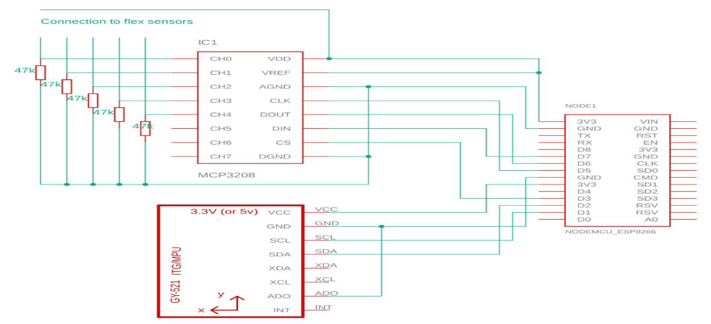
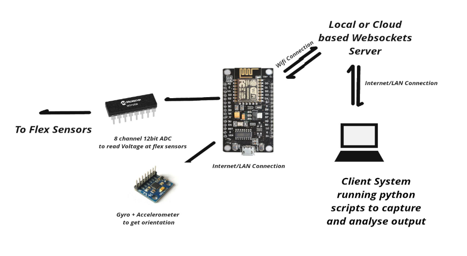
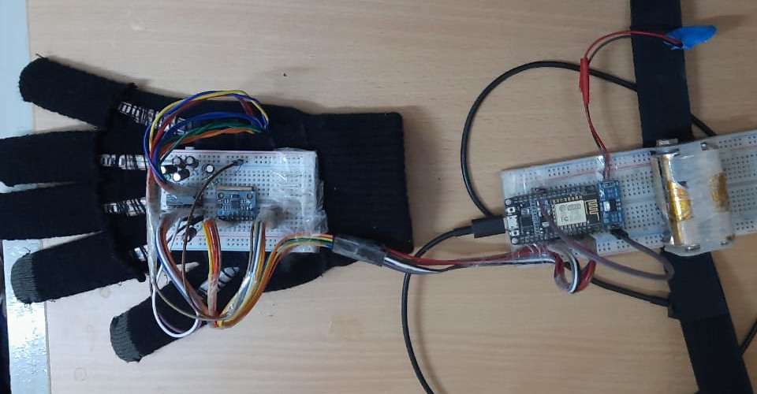
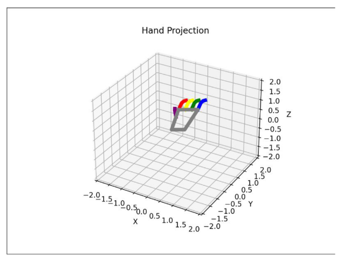

# Wireless-hand-tracking-glove
Low-cost and ergonomic human interface device which can be used to track precise hand movements and orientation.

The device design targets were-  
● Wireless or at least free from cumbersome wired connections.  
● Reasonably accurate with minimal delay.  
● Power Efficient.  
● Easy to integrate with any other project.  
● Cost-effective and should require minimal post-processing to work.  

# Design Elements - Hardware
● NodeMCU ESP8266 - Used as the main controller to provide the websocket connection to
the client over Wifi and to interface with the the accompanying sensors over I2C and SPI.  
● AMS 1117 - Used to provide regulated 3.3V supply to the NodeMCU from a 6V battery
pack.  
● MPU6050 - Gyro and Accelerometer chip with 6-axis DoF to accurately measure the the
Pitch and Roll of hand.  
● MCP3208 ADC - 8 channel ADC used to convert the voltage values at the flex sensors to
digital bits.  
● Flex Sensors - To track position of fingers.  

# Design Elements - Software
Device Side-  
● Arduino IDE - To write the code for NodeMCU  
● ESPAsyncTCP Library - To enable support for communication over websockets  
● MCP320x Library - To communicate with with the ADC  
● Adafruit MPU6050 Library - For I2c connection to the Accel/gyro sensor  
● Imufilter - For sensor fusion  
Client Side-  
● Python - To write client side code  
● MatplotLib - To create a 3D animation of the data received  
● Memcached - To buffer websocket data and provide asynchronous updatition of data in
background.  
● Python Websockets Module - To handle websocket stream on the client side.

# Hardware Interconnect

# Data Flow

# Possible Use Cases
● Can be used to provide gesture input to Robots for Automation.  
● Can be used for improving safety of worker in factories.  
● Can improve Efficiency & Productivity in manufacturing industries.  
● Enhanced Consistency & Accuracy as it is its very nature.  
● Can be used to provide a Complete Experience in Virtual Reality.  
● An improved version can even provide feedback about the touch.  

# Prototype

# Real World Performance
● Sampled output at upto 120Hz  
● Minimal Latency  
● Accurate Measurements  

*Output Recorded from animate.py
python script
